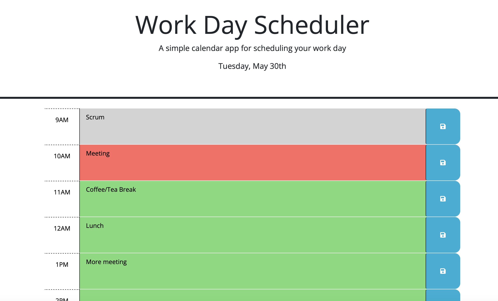

# 05-3rd-Party-APIs-Calender
## Description
Day Scheduler application created using JQuery and DayJS Libraries 

This application will display time block from 9AM to 5PM. Each time block represent an hour and allow to enter schedule description. This description will persist and reloaded on refresh. 

## Usage

Website has been deployed using GitHub pages and can be reached through below link,
https://chandraucb.github.io/05-3rd-Party-APIs-Calender/

## Reference
DayJS Reference to apply various formatting,
https://day.js.org/docs/en/display/display

JQuery api documentation
https://api.jquery.com/each/

